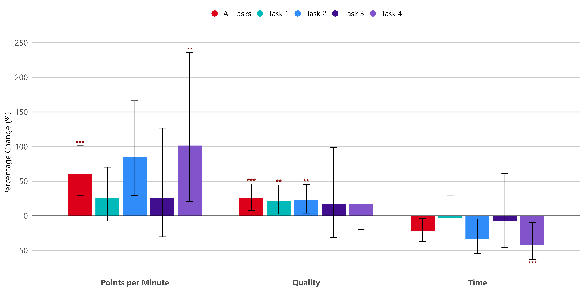

# Long Form Readings - 2026-02-11

## Building a C compiler with a team of parallel Claudes

*Written by Nicholas Carlini, a researcher on our Safeguards team. *I've been experimenting with a new approach to supervising language models that we’re calling "agent teams." With agent teams, multiple Claude instances work in parallel on a shared codebase without active human intervention. This approach dramatically expands the scope of what's achievable with LLM agents. To stress test it, I tasked 16 agents with writing a Rust-based C compiler, from scratch, capable of compiling the Linux kernel. Over nearly 2,000 Claude Code sessions and $20,000 in API costs, the agent team produced a 100,000-line compiler that can build Linux 6.9 on x86, ARM, and RISC-V.$!/$[The compiler is an interesting artifact](https://github.com/anthropics/claudes-c-compiler) on its own, but I focus here on what I learned about designing harnesses for long-running autonomous agent teams: how to write tests that keep agents on track without human oversight, how to structure work so multiple agents can make progress in parallel, and where this approach hits its ceiling.Enabling long-running ClaudesExisting agent scaffolds like Claude Code require an operator to be online and available to work jointly. If you ask for a solution to a long and complex problem, the model may solve part of it, but eventually it will stop and wait for continued input—a question, a status update, or a request for clarification.To elicit sustained, autonomous progress, I built a harness that sticks Claude in a simple loop (if you’ve seen Ralph-loop, this should look familiar). When it finishes one task, it immediately picks up the next. *(Run this in a container, not your actual machine).*#!/bin/bash while true; do COMMIT=$(git rev-parse --short=6 HEAD) LOGFILE="agent_logs/agent_${COMMIT}.log" claude --dangerously-skip-permissions \ -p "$(cat AGENT_PROMPT.md)" \ --model claude-opus-X-Y &> "$LOGFILE" doneCopyIn the agent prompt, I tell Claude what problem to solve and ask it to approach the problem by breaking it into small pieces, tracking what it’s working on, figuring out what to work on next, and to effectively keep going until it’s perfect. (On this last point, Claude has no choice. The loop runs forever—although in one instance, I did see Claude `pkill -9 bash` on accident, thus killing itself and ending the loop. Whoops!).Running Claude in parallelRunning multiple instances in parallel can address two weaknesses of a single-agent harness:One Claude Code session can only do one thing at a time. Especially as the scope of a project expands, debugging multiple issues in parallel is far more efficient.Running multiple Claude agents allows for specialization. While a few agents are tasked to solve the actual problem at hand, other specialized agents can be invoked to (for example) maintain documentation, keep an eye on code quality, or solve specialized sub-tasks.My implementation of parallel Claude is bare-bones. A new bare git repo is created, and for each agent, a Docker container is spun up with the repo mounted to `/upstream`. Each agent clones a local copy to `/workspace`, and when it's done, pushes from its own local container to upstream.To prevent two agents from trying to solve the same problem at the same time, the harness uses a simple synchronization algorithm:Claude takes a "lock" on a task by writing a text file to current_tasks/ (e.g., one agent might lock current_tasks/parse_if_statement.txt, while another locks current_tasks/codegen_function_definition.txt). If two agents try to claim the same task, git's synchronization forces the second agent to pick a different one.Claude works on the task, then pulls from upstream, merges changes from other agents, pushes its changes, and removes the lock. Merge conflicts are frequent, but Claude is smart enough to figure that out.The infinite agent-generation-loop spawns a new Claude Code session in a fresh container, and the cycle repeats.This is a very early research prototype. I haven’t yet implemented any other method for communication between agents, nor do I enforce any process for managing high-level goals. I don’t use an orchestration agent. Instead, I leave it up to each Claude agent to decide how to act. In most cases, Claude picks up the “next most obvious” problem. When stuck on a bug, Claude will often maintain a running doc of failed approaches and remaining tasks. In the [git repository](https://github.com/anthropics/claudes-c-compiler) of the project, you can read through the history and watch it take out locks on various tasks.Lessons from programming with Claude agent teamsThe scaffolding runs Claude in a loop, but that loop is only useful if Claude can tell how to make progress. Most of my effort went into designing the environment around Claude—the tests, the environment, the feedback—so that it could orient itself without me. These are the approaches I’ve found most helpful when orchestrating multiple Claude instances.Write extremely high-quality testsClaude will work autonomously to solve whatever problem I give it. So it’s important that the task verifier is nearly perfect, otherwise Claude will solve the wrong problem. Improving the testing harness required finding high-quality compiler test suites, writing verifiers and build scripts for open-source software packages, and watching for mistakes Claude was making, then designing new tests as I identified those failure modes.For example, near the end of the project, Claude started to frequently break existing functionality each time it implemented a new feature. To address this, I built a continuous integration pipeline and implemented stricter enforcement that allowed Claude to better test its work so that new commits can’t break existing code.Put yourself in Claude’s shoesI had to constantly remind myself that I was writing this test harness for Claude and not for myself, which meant rethinking many of my assumptions about how tests should communicate results.For example, each agent is dropped into a fresh container with no context and will spend significant time orienting itself, especially on large projects. Before we even reach the tests, to help Claude help itself, I included instructions to maintain extensive READMEs and progress files that should be updated frequently with the current status.I also kept in mind the fact that language models have inherent limitations, which, in this case, needed to be designed around. These include:**Context window pollution:** The test harness should not print thousands of useless bytes. At most, it should print a few lines of output and log all important information to a file so Claude can find it when needed. Logfiles should be easy to process automatically: if there are errors, Claude should write ERROR and put the reason on the same line so grep will find it. It helps to pre-compute aggregate summary statistics so Claude doesn't have to recompute them.**Time blindness:** Claude can't tell time and, left alone, will happily spend hours running tests instead of making progress. The harness prints incremental progress infrequently (to avoid polluting context) and includes a default `--fast `option that runs a 1% or 10% random sample. This subsample is deterministic per-agent but random across VMs, so Claude still covers all files but each agent can perfectly identify regressions.Make parallelism easyWhen there are many distinct failing tests, parallelization is trivial: each agent picks a different failing test to work on. After the test suite reached a 99% pass rate, each agent worked on getting a different small open-source project (e.g., SQlite, Redis, libjpeg, MQuickJS, Lua) to compile.But when agents started to compile the Linux kernel, they got stuck. Unlike a test suite with hundreds of independent tests, compiling the Linux kernel is one giant task. Every agent would hit the same bug, fix that bug, and then overwrite each other's changes. Having 16 agents running didn't help because each was stuck solving the same task.The fix was to use [GCC ](https://gcc.gnu.org/)as an online known-good compiler oracle to compare against. I wrote a new test harness that randomly compiled most of the kernel using GCC, and only the remaining files with Claude's C Compiler. If the kernel worked, then the problem wasn’t in Claude’s subset of the files. If it broke, then it could further refine by re-compiling some of these files with GCC. This let each agent work in parallel, fixing different bugs in different files, until Claude's compiler could eventually compile all files. (After this worked, it was still necessary to apply delta debugging techniques to find pairs of files that failed together but worked independently.)Multiple agent rolesParallelism also enables specialization. LLM-written code frequently re-implements existing functionality, so I tasked one agent with coalescing any duplicate code it found. I put another in charge of improving the performance of the compiler itself, and a third I made responsible for outputting efficient compiled code. I asked another agent to critique the design of the project from the perspective of a Rust developer, and make structural changes to the project to improve the overall code quality, and another to work on documentation.Stress testing the limits of agent teamsThis project was designed as a capability benchmark. I am interested in stress-testing the limits of what LLMs can just *barely* achieve today in order to help us prepare for what models will reliably achieve in the future.I’ve been using the C Compiler project as a benchmark across the entire Claude 4 model series. As I did with prior projects, I started by drafting what I wanted: a from-scratch optimizing compiler with no dependencies, GCC-compatible, able to compile the Linux kernel, and designed to support multiple backends. While I specified some aspects of the design (e.g., that it should have an SSA IR to enable multiple optimization passes) I did not go into any detail on how to do so.Previous Opus 4 models were barely capable of producing a functional compiler. Opus 4.5 was the first to cross a threshold that allowed it to produce a functional compiler which could pass large test suites, but it was still incapable of compiling any real large projects. My goal with Opus 4.6 was to again test the limits.EvaluationOver nearly 2,000 Claude Code sessions across two weeks, Opus 4.6 consumed 2 billion input tokens and generated 140 million output tokens, a total cost just under $20,000. Compared to even the most expensive Claude Max plans, this was an extremely expensive project. But that total is a fraction of what it would cost me to produce this myself—let alone an entire team.This was a clean-room implementation (Claude did not have internet access at any point during its development); it depends only on the Rust standard library. The 100,000-line compiler can build a bootable Linux 6.9 on x86, ARM, and RISC-V. It can also compile QEMU, FFmpeg, SQlite, postgres, redis, and has a 99% pass rate on most compiler test suites including the [GCC torture test suite](https://gcc.gnu.org/onlinedocs/gccint/Torture-Tests.html). It also passes the developer's ultimate litmus test: it can compile and run Doom.The compiler, however, is not without limitations. These include:It lacks the 16-bit x86 compiler that is necessary to boot Linux out of real mode. For this, it calls out to GCC (the x86_32 and x86_64 compilers are its own).It does not have its own assembler and linker; these are the very last bits that Claude started automating and are still somewhat buggy. The demo video was produced with a GCC assembler and linker.The compiler successfully builds many projects, but not all. It's not yet a drop-in replacement for a real compiler.The generated code is not very efficient. Even with all optimizations enabled, it outputs less efficient code than GCC with all optimizations *disabled.*The Rust code quality is reasonable, but is nowhere near the quality of what an expert Rust programmer might produce.The resulting compiler has nearly reached the limits of Opus’s abilities. I tried (hard!) to fix several of the above limitations but wasn’t fully successful. New features and bugfixes frequently broke existing functionality.As one particularly challenging example, Opus was unable to implement a 16-bit x86 code generator needed to boot into 16-bit real mode. While the compiler can output correct 16-bit x86 via the 66/67 opcode prefixes, the resulting compiled output is over 60kb, far exceeding the 32k code limit enforced by Linux. Instead, Claude simply cheats here and calls out to GCC for this phase (This is only the case for x86. For ARM or RISC-V, Claude’s compiler can compile completely by itself.)The [source code for the compiler is available](https://github.com/anthropics/claudes-c-compiler). Download it, read through the code, and try it on your favorite C projects. I’ve consistently found the best way to understand what language models can do is to push them to their limits, and then study where they start to break down. Over the coming days, I’ll continue having Claude push new changes if you want to follow along with Claude’s continued attempts at addressing these limitations.Looking forwardEach generation of language models opens up new ways of working with them. Early models were useful for tab-completion in IDEs. Before long, models could complete a function body from its docstring. The launch of Claude Code brought agents into the mainstream and enabled developers to pair-program with Claude. But each of these products operates under the assumption that a user defines a task, an LLM runs for a few seconds or minutes and returns an answer, and then the user provides a follow-up.Agent teams show the possibility of implementing entire, complex projects autonomously. This allows us, as users of these tools, to become more ambitious with our goals.We are still early, and fully autonomous development comes with real risks. When a human sits with Claude during development, they can ensure consistent quality and catch errors in real time. For autonomous systems, it is easy to see tests pass and assume the job is done, when this is rarely the case. I used to work in penetration testing, exploiting vulnerabilities in products produced by large companies, and the thought of programmers deploying software they’ve never personally verified is a real concern.So, while this experiment excites me, it also leaves me feeling uneasy. Building this compiler has been some of the most fun I’ve had recently, but I did not expect this to be anywhere near possible so early in 2026. The rapid progress in both language models and the scaffolds we use to interact with them opens the door to writing an enormous amount of new code. I expect the positive applications to outweigh the negative, but we’re entering a new world which will require new strategies to navigate safely.AcknowledgementsSpecial thanks to Josef Bacik, Edwin Chen, Bernardo Meurer Costa, Jake Eaton, Dan Kelley, Felix Klock, Jannet Park, Steve Weis, and many other people across Anthropic for their assistance and contributions.

## AI and the future of work: Measuring AI-driven productivity gains for workplace tasks

The rapid growth of AI capabilities and [increasing cross-economy adoption](https://www.ons.gov.uk/economy/economicoutputandproductivity/output/datasets/businessinsightsandimpactontheukeconomy), have sparked widespread discussion about the future impacts of AI on global economies and labour markets. There is great uncertainty about how AI will affect the UK labour market, and researchers are using a range of approaches aiming to answer this question. At the AI Security Institute (AISI), we’ve piloted an independent study targeted at a representative sample of the UK workforce. The research expands on the existing literature by creating a suite of generalisable benchmarks based on the O*NET taxonomy, and testing these in a controlled setting with human participants. This approach underpins a new framework for generating economy-wide impact estimates grounded in robust experimental data. The UK Government [recently announced](https://www.gov.uk/government/news/free-ai-training-for-all-as-government-and-industry-programme-expands-to-provide-10-million-workers-with-key-ai-skills-by-2030) the establishment of a comprehensive AI and the Future of Work Programme to ensure the UK is prepared to benefit from and adapt to the profound changes AI will bring to jobs, workers, and the labour market. This includes launching a new cross‑government AI and the Future of Work Unit and appointing an independent Expert Panel drawn from industry, academia, civil society and trade unions to guide this work. The study described in this blog post represents an early output from this new Unit’s AISI-based research arm.Our Research Design In the occupation automation literature jobs are often understood as bundles of tasks, some of which are common across different professions. This is formalised in the [Occupational Information Network (O*NET),](https://www.onetonline.org/) a comprehensive occupational taxonomy developed by the U.S. Department of Labour. For the purposes of the pilot study, we use the O*NET Generalised Work Activities. These represent the clearest examples of job behaviours* *common across occupations, for which it would be feasible to design experimental tasks. The generalised Work Activities are organised into 4 main categories: Information Input, Work Output, Interacting with Others, and Mental Processes. Given the necessarily limited scope of the pilot, we select from each category the Work Activity that is present across the greatest number of O*NET professions, shown in Figure 1. This gives the best balance between feasibility and drawing meaningfully generalisable conclusions.Figure 1: Selected O*NET Work ActivitiesWe designed experimental tasks to simulate real-world scenarios where these Work Activities would be deployed, without requiring domain-specific knowledge to carry out the task. This ensures that tasks are applicable across multiple professions. We worked with the Institute for the Future of Work (IFOW), their academic network, and experts from Educate Ventures to design and validate the tasks for this experiment. For the pilot phase of this research we aim to answer a key question: ***“To what extent does AI deliver productivity gains for individuals performing work-related tasks?”***. To isolate and measure these productivity gains, we use a randomised controlled trial (RCT) methodology. This approach selects two comparable groups from the same population and assigns a single intervention – in this case, access to a state-of-the-art large language model, released in early 2025 – to one group but not the other. Any subsequent differences we observe in outcomes can therefore be attributed to receiving the intervention. We randomly assigned these four tasks across 500 participants recruited via Prolific. Participants were then randomly allocated to either the Treatment (access to AI tools) or the Control (no access to AI tools) groups, and received a short tutorial on how to use the research platform functionalities and tooling available to them. Results All participant responses were graded using bespoke [AI autograders](https://www.aisi.gov.uk/blog/llm-judges-on-trial-a-new-statistical-framework-to-assess-autograders) calibrated to task-specific rubrics. A subset of responses from both Treatment and Control groups were graded by humans, with strong agreement between human and AI graders for Task 1, 2, and 4, and slightly weaker agreement for Task 3$^{1}$. For all participants we measure 3 outcome variables: Quality: The total score achieved on a task. Time: The total time taken to complete a task. Points per Minute: : a single productivity measure that divides the task score by the time taken. This assumes every extra minute adds the same amount of quality to an output (e.g. a score of 10 in 5 minutes is as good as a score of 20 in 10 minutes). Figure1: Selected O*NET Work Activities*Figure 2 shows the average percentage change in outcome of the Treatment Group relative to the Control Group that is due to AI use. The bars represent the magnitudes across the 3 respective outcome measures, with stars denoting the statistical significance of the estimates (*** p<0.01, ** p<0.05, * p<0.1). Outcome variables are transformed from a log scale to percentage changes. For Points per Minute and Quality Measures we would expect to see values greater than 0, in other words both measures are expected to improve with AI use. For Time we would expect to see a value below 0, in other words the Treatment Group performed tasks faster than the Control Group.*On average across the 4 tasks, we observe 25% higher points scored for participants in the Treatment groups, relative to their Control group counterparts, as well as 61% more Points per Minute. However, we do not see statistically significant differences between the 2 study groups in the time they took to complete the tasks. Decomposing the results by task, we observe variation in the impacts that AI augmentation has on participant productivity.  Figure 3: Individual Task Outcomes **Task 1 (Monitoring Processes, Materials, or Surroundings): **AI use provides significant uplift in task Quality (22%) but does not impact Time or Points per Minute. **Task 2 (Drafting, Laying Out, and Specifying Technical Devices, Parts, and Equipment**): We observe very similar results to Task 1, with AI providing a 23% uplift on task Quality, but none on our other metrics. **Task 3 (Organising, Planning, and Prioritising Work): **This is the only task where we do not observe any statistically significant uplift on any of our metrics. **Task 4 (Interpreting the Meaning of Information for Others):** For this task, we see the inverse of our results for Tasks 1 and 2 – AI use does not improve the Quality of performance but *does *improve Time (-42%) and Points per Minute (+102%). Decomposing the productivity impacts by task reveals the jagged capabilities of AI systems. Tasks 1, 2, and 4 all require some analysis, synthesis, and interpretation of data to answer close-ended questions – a domain in which we know AI systems excel. In contrast, Task 3 requires a more subjective and open-ended output, asking participants to produce forward-looking strategic proposals. While AI capabilities in this domain continue to improve, they [still lag behind](https://www.aisi.gov.uk/research/understanding-ai-trajectories-mapping-the-limitations-of-current-ai-systems) the more structured requirements present across the other tasks. Due to our limited sample size, we have a high degree of uncertainty around all of our estimates (though they are broadly in line with [other ](https://academic.oup.com/qje/article/140/2/889/7990658)[results found ](https://www.bing.com/ck/a?!&&p=6058a04f72f4c0e6e2e9a27da53e38248592c5906a9c0953750763652bc93b00JmltdHM9MTc2ODk1MzYwMA&ptn=3&ver=2&hsh=4&fclid=3a2bd05e-64c9-6db8-040b-c68165b06c0b&psq=%3b+Cui%2c+Z.+et+al.%2c+%22The+Productivity+Effects+of+Generative+AI%3a+Evidence+from+a+Field+Experiment+with+GitHub+Copilot%22%2c+March+2024&u=a1aHR0cHM6Ly9taXQtZ2VuYWkucHVicHViLm9yZy9wdWIvdjVpaXhrc3YvZG93bmxvYWQvcGRm)in the wider literature. As such, these results should be treated as preliminary indicators. Further analysis is required to establish greater confidence in the magnitude of impact across all three productivity measures.  Next Steps Our results suggest that AI could provide productivity gains for a significant number of workers across the UK; the 4 Work Activities we chose are present across all [412 SOC2020 occupational groups](https://www.nfer.ac.uk/key-topics-expertise/education-to-employment/the-skills-imperative-2035/resources/systematic-mapping-of-soc-2020/). However, we cannot say for sure whether these isolated impacts will drive substantial productivity improvements at the overall occupation level. We are building on the success of the pilot study, with work underway to expand the suite of Work Activities tested under this framework. This will enable us to build on our initial findings and provide comprehensive evidence on AI-driven productivity gains across the UK labour market. Furthermore, we plan to benchmark the performance of state-of-the-art AI system by testing agentic system capabilities on these tasks, with minimal human input. This will aim to address a key gap in the current literature by generating experimental evidence on the exposure of tasks, and therefore occupations, to automation across the UK economy. As the Department for Science, Innovation and Technology launches the AI and the Future of Work Unit, this research exemplifies the evidence-led approach at the heart of our mission. Our goal is to ground policy in robust experimental data, allowing us to anticipate disruption, harness productivity gains, and ensure the UK is prepared for the opportunities and challenges of AI-driven change. Acknowledgements *This research was conducted in collaboration with the Institute for the Future of Work, Educate Ventures, Frontier Economics, Revealing Reality, Prolific, and Faculty AI – with special thanks to Abby Gilbert, Rose Luckin, Benedict du Boulay, Noa Sher, Madiha Khan, Ali Chaudhry, Jolene Skordis and Arjun Ramani. *‍1. Krippendorff’s Alpha Statistics: Task 1 (α= 0.822), Task 2 (α= 0.919), Task 3 (α= 0.693), Task 4(0.841)[https://www.aisi.gov.uk/blog/ai-and-the-future-of-work-measuring-ai-driven-productivity-gains-for-workplace-tasks](https://www.aisi.gov.uk/blog/ai-and-the-future-of-work-measuring-ai-driven-productivity-gains-for-workplace-tasks)[https://www.aisi.gov.uk/blog/ai-and-the-future-of-work-measuring-ai-driven-productivity-gains-for-workplace-tasks](https://www.aisi.gov.uk/blog/ai-and-the-future-of-work-measuring-ai-driven-productivity-gains-for-workplace-tasks)

